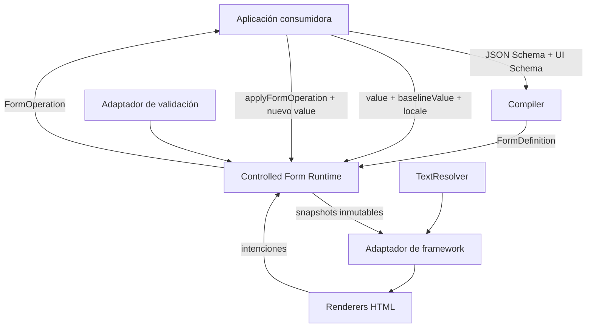
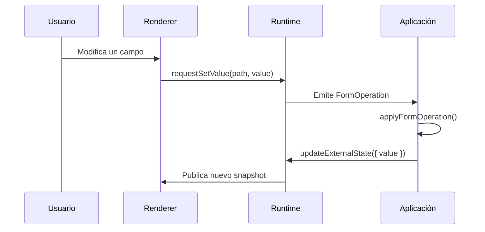

# SPEC-001: Controlled Form Runtime

- **Estado:** Accepted
- **Versión:** 0.1.15
- **Fecha:** 14 de julio de 2026
- **Fecha de aceptación:** 14 de julio de 2026
- **Ámbito:** Primer prototipo de `@rabassoft/schema-engine`
- **Documento relacionado:** [`../roadmap/deferred-decisions.md`](../roadmap/deferred-decisions.md)
- **Plan de implementación aprobado:** [`PLAN-001`](../plans/001-compiler-only-implementation.md)
- **Plan de operaciones aprobado:** [`PLAN-002`](../plans/002-root-immutable-operations.md)
- **Plan de runtime aprobado:** [`PLAN-003`](../plans/003-controlled-runtime.md)
- **Resolución de renderers:** [`ADR-007`](../adrs/007-resolucion-renderers-testers.md)
- **Instanciación Angular:** [`ADR-008`](../adrs/008-instanciacion-renderers-angular.md)
- **Plan de adaptador Angular:** [`PLAN-004`](../plans/004-angular-adapter.md)
- **Plan de renderers HTML nativos:** [`PLAN-005`](../plans/005-native-html-renderers.md)
- **Plan de enum string y select nativo aprobado:**
  [`PLAN-006`](../plans/006-string-enum-native-select.md)
- **Decisión arquitectónica del incremento:**
  [`ADR-011`](../adrs/011-enum-string-normalizado-select-nativo.md)
- **Limpieza explícita de campos nativos:**
  [`ADR-012`](../adrs/012-limpieza-explicita-campos.md)
- **Plan de limpieza explícita completado:**
  [`PLAN-007`](../plans/007-explicit-native-field-clearing.md)

## 1. Propósito

Esta especificación define el comportamiento del primer runtime de formularios dinámicos de Rabassoft Schema Engine.

El primer objetivo del ecosistema es generar formularios controlados a partir de **JSON Schema + UI Schema**, manteniendo la lógica de estado y validación independiente de Angular, React, Vue o cualquier otro framework.

La primera implementación de referencia utilizará Angular y controles HTML nativos, pero los contratos definidos en este documento deberán poder implementarse en otros frameworks sin reproducir la lógica del motor.

## 2. Objetivos

La primera versión deberá:

1. Compilar un subconjunto explícito de JSON Schema y UI Schema a una definición neutral.
2. Renderizar un formulario para un objeto raíz con campos primitivos.
3. Mantener un flujo de datos controlado y unidireccional.
4. Emitir operaciones incrementales en lugar de mutar el modelo de la aplicación.
5. Gestionar estado técnico de interacción y validación.
6. Integrar validadores, traducción y renderers mediante contratos sustituibles.
7. Ser utilizable con Angular Signals sin introducir Angular en el core.
8. Ofrecer diagnósticos tipados y evitar excepciones para errores esperables.

## 3. No objetivos de la primera versión

Quedan fuera del alcance inicial:

- Objetos anidados y arrays.
- `$ref`, `const`, `format`, `allOf`, `anyOf`, `oneOf`, `if`, `then` y `else`.
- Layouts complejos, secciones, pestañas o wizards declarados en UI Schema.
- Validación asíncrona.
- Actualización dinámica de la definición compilada.
- Modo autónomo o no controlado.
- Proyección optimista de cambios.
- Persistencia, envío, llamadas HTTP o estados de guardado.
- Angular Material, PrimeNG, Tailwind u otros sistemas visuales.
- Editor visual, colaboración, auditoría, undo/redo o licenciamiento.

Las decisiones aplazadas se registran en [`deferred-decisions.md`](../roadmap/deferred-decisions.md).

ADR-011 y PLAN-006 incorporan al contrato del siguiente incremento un
subconjunto de `enum` exclusivo de campos string, con choices normalizados y un
renderer select nativo. Este contrato amplía la implementación completada
M1-M5 mediante el milestone M6. `const`, `format`, enums no string y las demás
exclusiones de ADR-011 permanecen fuera de alcance.

ADR-012 incorpora al contrato de M7 una acción explícita de limpieza para los
cuatro renderers Angular nativos. Reutiliza `remove-value`, mantiene el flujo
controlado y no activa reset, defaults, permisos, null ni nuevas operaciones.

## 4. Terminología

### 4.1 Aplicación consumidora

Aplicación que proporciona el esquema, los datos, la persistencia y la integración con su framework o store.

### 4.2 Compilador

Componente que transforma JSON Schema + UI Schema en una `FormDefinition` normalizada.

### 4.3 Runtime

Motor agnóstico que recibe datos controlados, calcula el estado del formulario, gestiona interacciones y emite operaciones.

### 4.4 Adaptador de framework

Capa que proyecta los contratos neutrales del runtime a las primitivas de un framework. En Angular, convertirá snapshots a Signals y operaciones a outputs.

### 4.5 Renderer

Componente visual responsable de representar un tipo de campo y comunicar intenciones al runtime.

### 4.6 Valor controlado

Modelo de negocio cuya fuente de verdad pertenece a la aplicación consumidora.

### 4.7 Baseline

Valor de referencia utilizado para calcular si los campos gestionados por el formulario están modificados.

## 5. Contexto del sistema



## 6. Distribución inicial de responsabilidades

### 6.1 Aplicación consumidora

La aplicación será responsable de:

- Ser la única fuente de verdad del modelo de negocio.
- Proporcionar `value` y `baselineValue` de forma inmutable.
- Aplicar o rechazar las operaciones emitidas.
- Persistir datos y gestionar el envío.
- Definir scopes de validación cuando utilice pasos o secciones.
- Proporcionar o heredar el locale.
- Elegir integraciones de validación, traducción y presentación.

### 6.2 Core

El core será responsable de:

- Tipos, contratos y utilidades puras.
- Compilación a `FormDefinition`.
- Runtime controlado.
- Construcción y emisión de operaciones.
- Aplicación estricta de operaciones.
- Snapshots, interacción, dirty y validación.
- Diagnósticos neutrales.

El core no dependerá de Angular, React, Vue, RxJS, DOM, `window` ni una librería visual.

### 6.3 Adaptador Angular

El adaptador Angular será responsable de:

- Obtener por defecto `LOCALE_ID`.
- Proyectar snapshots a Signals.
- Exponer operaciones mediante outputs o callbacks idiomáticos.
- Resolver renderers mediante registrations y testers puntuados sobre
  `FieldDefinition`, conforme a ADR-007.
- Instanciar cada renderer inline mediante `ViewContainerRef.createComponent()`
  y bindings de creación, conforme a ADR-008.
- Crear y destruir el runtime con el ciclo de vida del componente.
- Generar identificadores DOM a partir de `formId` y la clave lógica del campo.

### 6.4 Renderers HTML

Los renderers HTML serán responsables de:

- Presentar campos normalizados.
- Gestionar estados visuales temporales, como texto numérico incompleto.
- Notificar foco, blur e intenciones de cambio.
- Mostrar errores según el snapshot y la política visual.
- No interpretar directamente JSON Schema.

## 7. Subconjunto inicial de metadatos

### 7.1 JSON Schema soportado

La raíz deberá declarar:

- `type: "object"`
- `properties`

La raíz podrá declarar:

- `required`
- `title`
- `description`

La ausencia de `required` equivale a no declarar campos obligatorios. `title` y
`description` son metadatos opcionales. `properties` puede estar vacío.

Los campos deberán declarar `type` explícitamente.

#### String

- `type: "string"`
- `title`
- `description`
- `default`
- `minLength`
- `maxLength`
- `pattern`
- `enum`, únicamente como array propio, no vacío, denso, compuesto por strings
  exactas y sin duplicados en un campo directo

#### Number e integer

- `type: "number" | "integer"`
- `title`
- `description`
- `default`
- `minimum`
- `maximum`
- `multipleOf`

#### Boolean

- `type: "boolean"`
- `title`
- `description`
- `default`

El dialecto de referencia y la política de compatibilidad están definidos en [`ADR-005`](../adrs/005-politica-dialecto-json-schema.md).

### 7.2 UI Schema inicial

El UI Schema solo describirá presentación:

```ts
export interface UiSchema {
  readonly order?: readonly string[];
  readonly fields?: Readonly<Record<string, FieldUiSchema>>;
}

export interface FieldUiSchema {
  readonly label?: string;
  readonly description?: string;
  readonly hint?: string;
  readonly tooltip?: string;
  readonly placeholder?: string;
  readonly enumLabels?: Readonly<Record<string, string>>;
  readonly options?: {
    readonly decimalPlaces?: number;
    readonly showTrailingZeros?: boolean;
  };
}
```

Reglas:

- `order` coloca primero los campos indicados.
- Los campos omitidos se añaden al final respetando el orden de `properties`.
- Duplicados y campos desconocidos generan warnings no bloqueantes.
- `hint` representa ayuda breve y persistente próxima al control.
- `tooltip` representa información complementaria bajo demanda; el renderer deberá exponerla de forma accesible y no depender exclusivamente del hover.
- `placeholder` representa una sugerencia o ejemplo temporal dentro del control y nunca sustituirá a `label`.
- `placeholder` se admitirá inicialmente en campos `string`, `number` e `integer`. Su uso en un campo no compatible generará un warning no bloqueante.
- `decimalPlaces` y `showTrailingZeros` son exclusivamente visuales.
- La precisión válida continúa dependiendo de `multipleOf`.
- `enumLabels` es un miembro directo del campo UI, no de `options`, y sus keys
  corresponden exactamente a valores del `enum` string compatible.
- Cada label propio deberá ser string no blank según
  `label.trim().length > 0`; el texto se conserva opaco y sin transformarlo.
- Una key estructuralmente válida que no corresponda a una choice producirá
  `UNKNOWN_ENUM_LABEL` y se ignorará sin alterar el orden del `enum`.
- Un `enumLabels` con forma exterior inválida producirá
  `INVALID_UI_SCHEMA_VALUE` incluso si la rama del schema está bloqueada.
- Un objeto `enumLabels` estructuralmente válido sobre un campo válido sin
  `enum` producirá un único `INCOMPATIBLE_UI_OPTION` con
  `reason: 'missing-compatible-enum'` y no recorrerá sus miembros.
- Un objeto exterior válido sobre un tipo ausente/no soportado o un enum
  `schema-blocked` se ignorará sin diagnósticos derivados de compatibilidad o
  members. Solo un enum string válido permite recorrer los labels.
- Todas las inspecciones de `enumLabels` usarán propiedades propias y
  descriptores; ningún accessor se ejecutará, tampoco en una rama ignorada.

La forma exterior accessor producirá `INVALID_UI_SCHEMA_VALUE` en
`['fields', fieldName, 'enumLabels']` con `key: 'enumLabels'`,
`expected: 'object'` y `actualType: 'accessor'`. Un valor null, array o no
objeto usará el mismo código, key, expected y path con su descripción segura.
Con enum válido, los keys propios enumerables se recorrerán en orden
`Object.keys()`: un descriptor ausente/accessor, valor no string o string blank
producirá `INVALID_UI_SCHEMA_VALUE` en
`['fields', fieldName, 'enumLabels', labelKey]`, con `key: labelKey`,
`expected: 'non-blank string'` y el actual seguro. Esa entrada no producirá
además `UNKNOWN_ENUM_LABEL`.

### 7.3 Precedencia y semántica de textos

Para etiqueta y descripción:

1. UI Schema.
2. JSON Schema.
3. Nombre de la propiedad como fallback de etiqueta.

`hint`, `tooltip` y `placeholder` pertenecen exclusivamente al UI Schema en esta primera versión y no tendrán fallback implícito.

Cada texto tendrá una responsabilidad diferenciada:

- `label`: identifica el campo y deberá permanecer visible o accesible para tecnologías de asistencia.
- `description`: explica el significado general del campo.
- `hint`: ofrece ayuda breve y visible durante la edición.
- `tooltip`: aporta información adicional bajo demanda.
- `placeholder`: muestra un ejemplo o formato esperado mientras el control está vacío.

Los textos son cadenas opacas. Un `TextResolver` decidirá si representan texto literal, clave de traducción u otro identificador.

## 8. Compilación y definición normalizada

Los adaptadores y renderers no interpretarán directamente JSON Schema. El compilador generará una definición neutral.

```ts
export interface FormDefinition {
  readonly fields: readonly FieldDefinition[];
}

export interface BaseFieldDefinition {
  readonly key: string;
  readonly name: string;
  readonly path: DataPath;
  readonly required: boolean;
  readonly label: string;
  readonly description?: string;
  readonly hint?: string;
  readonly tooltip?: string;
  readonly placeholder?: string;
}

export interface StringChoiceDefinition {
  readonly value: string;
  readonly label: string;
}

export type FieldDefinition =
  StringFieldDefinition | NumberFieldDefinition | BooleanFieldDefinition;

export interface StringFieldDefinition extends BaseFieldDefinition {
  readonly kind: 'string';
  readonly constraints: {
    readonly minLength?: number;
    readonly maxLength?: number;
    readonly pattern?: string;
  };
  readonly choices?: readonly StringChoiceDefinition[];
}

export interface NumberFieldDefinition extends BaseFieldDefinition {
  readonly kind: 'number';
  readonly numericType: 'number' | 'integer';
  readonly constraints: {
    readonly minimum?: number;
    readonly maximum?: number;
    readonly multipleOf?: number;
  };
  readonly ui: {
    readonly decimalPlaces?: number;
    readonly showTrailingZeros?: boolean;
  };
}

export interface BooleanFieldDefinition extends BaseFieldDefinition {
  readonly kind: 'boolean';
}
```

`DataPath` será la identidad canónica del campo. `key` será una clave lógica determinista derivada de la ruta, pero no un ID DOM definitivo.

```ts
export type PathSegment = string | number;
export type DataPath = readonly PathSegment[];
```

La definición será inmutable durante la vida del runtime. Un cambio de JSON Schema o UI Schema requerirá recompilar y crear un runtime nuevo.

`choices` ausente significa que el campo string no declara un `enum` soportado.
Cuando esté presente será no vacío, conservará el orden del schema, contendrá
valores string exactos y únicos, y asignará a cada choice un label fuente no
blank. El array, cada choice y la definición compilada serán profundamente
inmutables. Renderers y testers consumirán esta normalización y nunca el JSON
Schema crudo.

`StringChoiceDefinition`, las extensiones transitivas de definición/UI/textos y
el componente Angular de enum serán Public + Experimental + Active conforme a
ADR-009. No se añade ningún entry point ni export map y ninguna API se promueve
a Stable.

### 8.1 Entrada de compilación

```ts
export interface CompileFormDefinitionInput {
  readonly schema: unknown;
  readonly uiSchema?: unknown;
}

export function compileFormDefinition(
  input: CompileFormDefinitionInput,
): CompileFormResult;
```

`uiSchema` ausente equivale a un UI Schema vacío. Las entradas se aceptan como
`unknown` para que los errores esperables de configuración se expresen mediante
diagnósticos y no mediante excepciones.

### 8.2 Resultado de compilación

```ts
export type CompileFormResult =
  | {
      readonly success: true;
      readonly definition: FormDefinition;
      readonly diagnostics: readonly Diagnostic[];
    }
  | {
      readonly success: false;
      readonly diagnostics: readonly Diagnostic[];
    };
```

Los errores normales de configuración no lanzarán excepciones.

PLAN-001 define el pipeline determinista, la validación estructural, la
normalización de UI Schema, la inmutabilidad observable, los parámetros de
diagnóstico y los fixtures obligatorios para el primer incremento del
compilador. Cualquier error produce `success: false` sin definición parcial;
un resultado con solo warnings puede incluir una definición válida.

### 8.3 Normalización de `enum` string

La clasificación de la keyword será:

- `enum` válido en un campo string directo: soportado y normalizado;
- `enum` en number, integer o boolean: `INCOMPATIBLE_SCHEMA_KEYWORD` bloqueante;
- `enum` en la raíz: `UNSUPPORTED_SCHEMA_KEYWORD` bloqueante;
- `const`: continúa como `UNSUPPORTED_SCHEMA_KEYWORD`;
- `format`: continúa como `IGNORED_SCHEMA_KEYWORD` warning.

El candidato interno distinguirá `absent`, `valid` y `schema-blocked`. Un tipo
ausente o no soportado no genera candidato. Solo `valid` transporta valores;
`schema-blocked` conserva el error del schema e impide diagnósticos UI derivados
de compatibilidad o members.

La inspección será descriptor-safe y seguirá estas reglas:

1. Un descriptor accessor para `enum` producirá
   `INVALID_SCHEMA_KEYWORD_VALUE`, `expected: 'array of unique strings'` y
   `actualType: 'accessor'`, sin ejecutar el getter.
2. Un valor que no sea array producirá el mismo diagnóstico y `expected` con
   la descripción segura del valor actual.
3. Un array vacío utilizará
   `expected: 'non-empty array of unique strings'`.
4. Los índices se inspeccionarán de `0` a `length - 1` mediante su descriptor
   propio. Un índice ausente/sparse o accessor usará `expected: 'string'` y
   `actualType: 'missing'` o `'accessor'`, respectivamente.
5. Un elemento no string usará `expected: 'string'`; la segunda aparición y
   cada aparición posterior de un duplicado usará
   `expected: 'unique string'`.
6. Se recopilarán todos los errores de elementos independientemente
   descubribles en orden de índice. Cualquier error deja la rama
   `schema-blocked` y no produce una definición parcial.
7. Las strings válidas se copiarán en orden sin trim, coercion, case folding,
   normalización Unicode ni mutación del array fuente.

Los `documentPath` serán la ruta exacta de la keyword o del índice bajo
`['properties', fieldName, 'enum']`; los diagnósticos de campo usarán
`dataPath: [fieldName]`. Los diagnósticos de schema precederán a los de UI
Schema.

Tras una compilación sin errores bloqueantes, cada value recibirá como label su
entrada propia válida en `enumLabels`; en su ausencia se usará el propio value
si es no blank o `JSON.stringify(value)` si es blank. Esto hace visibles `""`
y strings formadas solo por espacios sin cambiar el valor de dominio. El orden
siempre pertenece al `enum`.

## 9. Modelo controlado

La primera versión funcionará exclusivamente en modo controlado estricto.



Reglas:

- El runtime no modificará internamente el modelo controlado.
- No mostrará definitivamente un cambio hasta que la aplicación proporcione el nuevo `value`.
- Recibir un valor externo nunca emitirá una operación de vuelta.
- No existirá proyección optimista en la primera versión.

## 10. Valor, baseline y dirty

La aplicación proporcionará:

```ts
export interface ControlledExternalState<TData extends object> {
  readonly value: Readonly<TData>;
  readonly baselineValue: Readonly<TData>;
  readonly locale: string;
}
```

El runtime calculará `dirty` comparando los campos gestionados por `FormDefinition` entre `value` y `baselineValue` mediante `Object.is` para los valores primitivos iniciales.

Las propiedades no definidas por el formulario:

- Se preservarán.
- No se renderizarán.
- No participarán en `dirty`.

Actualizar el baseline no reiniciará `touched`, foco ni visibilidad de errores.

## 11. Operaciones incrementales

### 11.1 Expectativas

```ts
export type OperationExpectation =
  | { readonly kind: 'missing' }
  | { readonly kind: 'value'; readonly value: unknown };
```

### 11.2 Metadatos

```ts
export interface FormOperationMetadata {
  readonly id: number;
  readonly formId: string;
}
```

El identificador comenzará en `1` y será secuencial por instancia de runtime.

### 11.3 Set value

```ts
export interface SetValueOperation {
  readonly type: 'set-value';
  readonly metadata: FormOperationMetadata;
  readonly path: DataPath;
  readonly expected: OperationExpectation;
  readonly value: unknown;
  readonly source: 'user';
}
```

### 11.4 Remove value

```ts
export interface RemoveValueOperation {
  readonly type: 'remove-value';
  readonly metadata: FormOperationMetadata;
  readonly path: DataPath;
  readonly expected: {
    readonly kind: 'value';
    readonly value: unknown;
  };
  readonly source: 'user';
}
```

```ts
export type FormOperation = SetValueOperation | RemoveValueOperation;
```

### 11.5 Reglas estrictas

- Las rutas se representarán mediante arrays de segmentos.
- `DataPath` puede representar la raíz mediante `[]`, pero las utilidades de M2
  aceptarán únicamente propiedades raíz mediante un path `[fieldName]` con un
  solo segmento string.
- M2 rechazará `[]`, segmentos numéricos y paths con más de un segmento.
- `set-value` podrá crear únicamente una propiedad raíz.
- Los paths profundos, contenedores intermedios, objetos anidados y arrays
  permanecen aplazados.
- `remove-value` exige que la propiedad final exista.
- La expectativa se comprobará mediante `Object.is`.
- Una discrepancia producirá `STALE_OPERATION`.
- El runtime no emitirá una operación si la intención no produce un cambio efectivo.

### 11.6 Aplicación de operaciones

El core expondrá dos niveles:

```ts
applyOperation(currentValue, operation);
applyFormOperation(definition, currentValue, operation);
```

- `applyOperation` será una utilidad estructural avanzada.
- `applyFormOperation` será la API recomendada.
- `applyFormOperation` verificará que la ruta pertenece al formulario y que el valor es compatible con el tipo básico.
- Las restricciones de negocio como `minimum` o `pattern` serán responsabilidad del validador.
- Ambas utilidades serán puras e inmutables y conservarán las ramas no afectadas.

El resultado de ambas utilidades será:

```ts
export type ApplyOperationResult<TData extends object> =
  | {
      readonly success: true;
      readonly value: Readonly<TData>;
      readonly changed: boolean;
      readonly diagnostics: readonly [];
    }
  | {
      readonly success: false;
      readonly value: Readonly<TData>;
      readonly changed: false;
      readonly diagnostics: readonly Diagnostic[];
    };
```

En caso de error, `value` conservará exactamente la referencia de entrada. Una
operación válida sin efecto devolverá `success: true`, `changed: false`, la
misma referencia y ningún diagnóstico.

## 12. Intenciones del renderer

Los renderers no construirán operaciones directamente.

```ts
runtime.requestSetValue(['age'], 49);
runtime.requestRemoveValue(['age']);
```

El runtime utilizará el último estado confirmado para construir la expectativa y emitir la operación completa.

## 13. Estado de interacción

El runtime gestionará:

- `touched`
- `focused`
- visibilidad forzada de errores

El valor y el baseline continuarán controlados por la aplicación.

Reglas de foco:

- Solo puede existir un campo enfocado por runtime.
- `focus(path)` actualiza el campo activo.
- `blur(path)` solo actúa si el campo estaba enfocado.
- Un blur válido establece `focused: false` y `touched: true`.
- `resetTouched(scope?)` solo reinicia `touched`.

`dirty` nunca se almacenará como una transición de interacción; será un estado derivado.

## 14. Validación

### 14.1 Puerto neutral

El core no implementará su propio validador JSON Schema.

```ts
export interface SchemaValidator {
  validate(schema: unknown, value: unknown): ValidationResult;
}
```

La primera integración oficial se publicará en un paquete sustituible, previsiblemente `@rabassoft/schema-engine-validator-ajv`.

### 14.2 Issues normalizados

```ts
export interface ValidationIssue {
  readonly code: string;
  readonly path: DataPath;
  readonly keyword?: string;
  readonly parameters: Readonly<Record<string, unknown>>;
  readonly fallbackMessage?: string;
}
```

Reglas:

- Los adaptadores normalizarán los errores al campo más específico posible.
- `path: []` se reservará para errores globales.
- El runtime conservará todos los issues de cada campo.
- La capa visual decidirá si muestra el primero, todos o una representación personalizada.
- `code`, `path` y `parameters` serán canónicos; `fallbackMessage` será auxiliar.

### 14.3 Ciclo inicial

- La validación será síncrona.
- Se recalculará cuando cambie la referencia de `value`.
- Un dato inválido no impedirá crear el runtime.
- Una raíz estructuralmente incompatible sí impedirá crearlo.
- Inicialmente se validará el modelo completo y se filtrarán los issues para scopes parciales.

## 15. Visibilidad de errores

```ts
export type ValidationVisibility = 'touched' | 'all';
```

Por defecto se utilizará `touched`.

- La validez real siempre estará calculada.
- `touched` representa interacción, no una política visual.
- Mostrar todos los errores no marcará los campos como tocados.
- La aplicación podrá cambiar la política dinámicamente.

## 16. Scopes de formulario

Los scopes serán definidos por la aplicación y no formarán parte del UI Schema inicial.

```ts
export interface FormScope {
  readonly id: string;
  readonly paths: readonly DataPath[];
  readonly includeGlobalIssues?: boolean;
}
```

El runtime permitirá:

```ts
runtime.getValidationSnapshot(scope);
runtime.showValidationErrors(scope);
runtime.hideValidationErrors(scope.id);
runtime.resetTouched(scope);
```

Reglas:

- No será necesario registrar scopes previamente.
- Las rutas desconocidas generarán warnings no bloqueantes y se ignorarán.
- Los scopes podrán solaparse.
- Ocultar un scope no ocultará errores mantenidos visibles por otro scope.
- Un scope puede representar un paso, pestaña, sección o cualquier agrupación de la aplicación.

### 16.1 Persistencia incremental y baseline

La aplicación es responsable de construir de forma inmutable el nuevo baseline
cuando persiste un scope y de proporcionarlo mediante `updateExternalState()`.
Guardar un scope no afectará al baseline ni al estado dirty de los campos que la
aplicación no haya confirmado.

El primer prototipo no expone `commitScopeToBaseline()`. Una utilidad reutilizable
para copiar al baseline únicamente las rutas válidas de un scope queda aplazada
como [D-038](../roadmap/deferred-decisions.md#d-038-utilidad-para-confirmar-un-scope-en-el-baseline).

## 17. Campos ausentes y valores vacíos

La ausencia de una propiedad se distinguirá de valores explícitos:

```text
{} ≠ { active: false }
{} ≠ { name: "" }
{} ≠ { age: 0 }
```

Representación inicial:

- String ausente: control visual vacío.
- Number ausente: control visual vacío.
- Boolean ausente: checkbox desmarcado.

El runtime no introducirá valores automáticamente al renderizar.

Reglas al vaciar:

- String vacío: `set-value` con `""`.
- Boolean desmarcado: `set-value` con `false`.
- Number vacío: `remove-value`.
- `undefined` no formará parte del modelo.
- `null` solo será válido cuando una futura ampliación del esquema lo permita explícitamente.

Los booleanos iniciales serán binarios. Un booleano ausente se mostrará desmarcado, pero al interactuar pasará a existir con `true` o `false`.

## 18. Defaults

Los defaults no se aplicarán silenciosamente al renderizar.

El compilador reconoce `default` como metadata soportada, pero no la copia a
`FormDefinition`, no modifica el valor y no selecciona defaults por la
aplicación. El primer prototipo tampoco expone `applySchemaDefaults()`.

La semántica y una posible utilidad explícita para aplicar defaults, por ejemplo
al crear una entidad, quedan aplazadas como
[D-039](../roadmap/deferred-decisions.md#d-039-aplicación-explícita-de-defaults-del-schema).

## 19. Localización e internacionalización

### 19.1 Locale

- La aplicación será la fuente predeterminada del locale.
- Angular lo heredará normalmente de `LOCALE_ID`.
- Un formulario podrá sobrescribirlo explícitamente.
- El locale podrá cambiar durante la vida del runtime.
- El modelo conservará números canónicos de JavaScript.
- Cambiar el locale no emitirá operaciones ni alterará dirty, touched o validación.

Los campos sin foco se reformatearán inmediatamente. El campo numérico activo conservará su texto temporal y aplicará el nuevo locale al perder el foco.

### 19.2 Resolución de textos

```ts
export type FieldTextMember =
  | 'label'
  | 'description'
  | 'hint'
  | 'tooltip'
  | 'placeholder'
  | 'clear'
  | 'choice'
  | 'issue';

export type TextResolutionContext =
  | {
      readonly formId: string;
      readonly locale: string;
      readonly field: FieldDefinition;
      readonly member: Exclude<FieldTextMember, 'choice' | 'issue'>;
      readonly choice?: never;
      readonly issue?: never;
    }
  | {
      readonly formId: string;
      readonly locale: string;
      readonly field: FieldDefinition;
      readonly member: 'choice';
      readonly choice: StringChoiceDefinition;
      readonly issue?: never;
    }
  | {
      readonly formId: string;
      readonly locale: string;
      readonly field: FieldDefinition;
      readonly member: 'issue';
      readonly choice?: never;
      readonly issue: ValidationIssue;
    };

export interface TextResolver {
  resolve(text: string, context: TextResolutionContext): string;
}
```

La implementación por defecto devolverá el texto sin modificar. Cambiar el
locale volverá a resolver etiquetas, descripciones, hints, tooltips,
placeholders, choices y mensajes. El outlet Angular proyectará un snapshot de
textos resueltos e inmutable para que renderers nativos y personalizados
compartan la misma política.

```ts
export interface AngularFieldTextSnapshot {
  readonly label: string;
  readonly description?: string;
  readonly hint?: string;
  readonly tooltip?: string;
  readonly placeholder?: string;
  readonly clearLabel: string;
  readonly choiceLabels: readonly string[];
  readonly issueMessages: readonly string[];
}
```

`clearLabel` existirá siempre, será no blank e inmutable. `choiceLabels`
existirá siempre, estará vacío sin choices, será inmutable y se alineará por
índice con `field.choices`. El orden de proyección será label, description,
hint, tooltip, placeholder, clear, choices en orden de definición e issues en
orden de snapshot.

La acción clear resolverá la fuente neutral `Clear` con `member: 'clear'` y el
contexto del field. Una excepción, resultado no string o blank conservará
`Clear` y emitirá exactamente un `TEXT_RESOLUTION_FAILED` por proyección, con
`member: 'clear'`, reason `exception`, `non-string-result` o
`blank-string-result`, `dataPath` como copia inmutable de `field.path` y sin
`documentPath`.

Cada choice se resolverá con su objeto original en la rama `member: 'choice'`.
Una excepción, resultado no string o string blank conservará el label fuente no
blank y emitirá un `TEXT_RESOLUTION_FAILED` warning de fuente `runtime` con
`field`, `member: 'choice'`, `choiceValue` y reason `exception`,
`non-string-result` o `blank-string-result`. Su `dataPath` será una copia
inmutable de `field.path` y no tendrá `documentPath`.

Se añadirá exactamente un warning por choice fallida, en orden de choice, en
cada proyección. El array completo de diagnósticos será inmutable y el outlet
lo reenviará una sola vez. La identidad de proyección será exactamente la
identidad del field, `formId`, locale e identidad del array de issues del campo:
un cambio de cualquiera puede reproyectar, mientras otros cambios de snapshot
no repiten la resolución ni sus diagnósticos.

## 20. Comportamiento de los renderers iniciales

Cada renderer Angular nativo utilizará un `form()` y `FormField` privado de
Angular 22 para enlazar exclusivamente el control hoja. Su modelo local será un
buffer efímero de presentación: no será value, baseline, snapshot, validación,
dirty ni touched autoritativo. Una confirmación externa reconciliará el buffer y
blur restaurará el último valor confirmado. No se crearán schemas de validación,
submission, `FormRoot` ni bridges compat de Angular Forms.

### 20.1 String

- Emitirá una intención en cada modificación.
- Conservará exactamente el texto introducido.
- No aplicará trim, mayúsculas ni transformaciones implícitas.
- Mostrará `placeholder` únicamente mientras el control esté vacío y sin utilizarlo como sustituto de la etiqueta.
- Debounce y persistencia serán responsabilidad de la aplicación.

### 20.2 Number e integer

- Podrá mostrar un `placeholder` localizado o resuelto por `TextResolver` mientras el control esté vacío.
- Utilizará una representación textual temporal mientras tenga foco.
- Permitirá estados intermedios como `-`, `12,` o `0.` sin enviarlos al modelo.
- Emitirá únicamente cuando el texto pueda interpretarse como número válido.
- Aplicará `decimalPlaces` al perder el foco, no en cada pulsación.
- Si el texto no es convertible al perder el foco, lo descartará y restaurará el último valor confirmado.
- El parser respetará el locale de la aplicación.
- `decimalPlaces` nunca redondeará ni validará el modelo.

### 20.3 Boolean

- Se representará inicialmente mediante un control binario.
- Ausente se verá desmarcado.
- Marcar emitirá `true`.
- Desmarcar emitirá `false`.
- No se restaurará automáticamente el estado ausente.

### 20.4 Enum string y select nativo

Un campo string con `choices` propias y válidas se especializará mediante
`SchemaStringEnumRendererComponent`, componente standalone Public +
Experimental + Active con selector `schema-string-enum-renderer`, ubicado en
`packages/angular/src/native/string-enum-renderer.ts` y exportado desde el entry
point Angular existente. Importará `FormField` y usará change detection
`OnPush`.

Su registration `native-string-enum` tendrá rank `20` y priority `0`. El
renderer string genérico conservará rank `10`, y los overrides de consumidor
seguirán las reglas de rank, priority y orden de ADR-007. El provider headless
no lo incluirá; `provideSchemaEngineAngularNative()` lo añadirá a la misma
secuencia inmutable de registrations.

El tester leerá únicamente el descriptor propio `choices` y devolverá rank 20
solo para una data property con array no vacío. No ejecutará accessors ni
recorrerá los miembros de las choices; la validación estructural completa
pertenece a la creación del runtime.

El `<select>` enlazará un único leaf string de Signal Forms privado cuyo valor
será solo un token de presentación:

- `''` representará el centinela interno para missing o valor externo fuera del
  enum;
- cada choice usará `choice:<index>` y se mapeará de vuelta al value exacto;
- el string de dominio `""` será una choice ordinaria y nunca colisionará con el
  centinela;
- el centinela será disabled, mostrará el placeholder resuelto si existe y no
  actuará por sí mismo como limpieza;
- una selección de usuario válida emitirá solo `setValue` con el string de
  dominio; tokens malformed, fuera de rango o el centinela se ignorarán;
- render inicial, reconciliación externa, rechazo, locale, blur y cambio de
  textos no emitirán operaciones ni corregirán el modelo controlado.

El componente reutilizará el contrato accesible de los renderers M5: label,
description, hint, tooltip, issues, foco, blur, IDs, `aria-describedby`,
`aria-invalid`, `aria-required`, `focusBoundControl()` y destrucción del binding
local. Los option texts procederán exclusivamente de `texts.choiceLabels`.
Ningún renderer resolverá textos, interpretará schema crudo, validará pertenencia
al enum, elegirá defaults ni mutará estado de aplicación.

### 20.5 Limpieza explícita

Los cuatro renderers nativos mostrarán un botón `type="button"` únicamente
cuando `snapshot.presence.kind === 'value'`, incluidos `""`, `0`, `false` y
valores incompatibles con el renderer. Required no ocultará ni deshabilitará la
acción; el validador externo conservará la autoridad sobre sus issues.

La activación solicitará foco sobre el control mediante `focusBoundControl()`
antes de emitir exactamente un `removeValue`. El intento de foco no condicionará
la intención. La aplicación podrá confirmar o rechazar la operación y el
renderer no proyectará missing optimistamente ni emitirá durante render,
reconciliación, locale, textos o lifecycle.

`FieldIds` incluirá `label` y `clear`. El botón mostrará `clearLabel` y usará
`aria-labelledby` en el orden `ids.clear ids.label`. La acción no equivale a
`""`, `0`, `false`, `null`, un default, reset ni persistencia. Los custom
renderers recibirán el snapshot de textos ampliado, pero no estarán obligados a
mostrar la affordance.

## 21. Runtime y snapshots

### 21.1 Creación

```ts
export interface ControlledFormRuntimeOptions<TData extends object> {
  readonly formId: string;
  readonly definition: FormDefinition;
  readonly schema: unknown;
  readonly value: Readonly<TData>;
  readonly baselineValue: Readonly<TData>;
  readonly locale: string;
  readonly validator: SchemaValidator;
  readonly validationVisibility?: ValidationVisibility;
}
```

`formId` será obligatorio y distinguirá instancias visuales de una misma definición.

El adaptador Angular expondrá una configuración pre-release equivalente salvo
por locale opcional:

```ts
export type AngularControlledFormConfig<TData extends object> = Omit<
  ControlledFormRuntimeOptions<TData>,
  'locale'
> & {
  readonly locale?: string;
};
```

`undefined` utilizará `LOCALE_ID`; una string vacía seguirá siendo inválida.

Después de validar la forma base de cada field, la creación inspeccionará el
miembro propio `choices` únicamente cuando `kind === 'string'`:

- un miembro ausente o heredado equivale a no declarar choices;
- un miembro propio accessor es inválido y nunca se ejecuta;
- un data member propio deberá ser un array denso y no vacío;
- cada índice deberá ser una data property propia con un objeto no array;
- cada choice deberá aportar data properties propias `value` y `label`;
- `value` deberá ser string y único; `label`, string no blank;
- sparse arrays, accessors, miembros ausentes/heredados, duplicados y valores
  malformed serán inválidos.

Una definición manual inválida por choices bloqueará antes de invocar
`SchemaValidator.validate()` y devolverá exactamente un diagnóstico inmutable
`INVALID_RUNTIME_OPTIONS`, severidad `error`, fuente `runtime`, con:

```ts
{
  member: 'definition',
  expected: 'valid FormDefinition with string choices',
  reason: 'invalid-value',
  actualType: 'object',
}
```

Los errores de la forma base conservarán
`expected: 'valid root FormDefinition'`. El runtime no clonará ni congelará una
definición manual y no la revalidará en cada acción; mutarla después de crear el
runtime no está soportado. `applyOperation()` y `applyFormOperation()` no leerán
ni validarán `choices`, y runtime/operaciones no impondrán pertenencia al enum.

### 21.2 Snapshot público

```ts
export interface FormRuntimeSnapshot<TData extends object> {
  readonly value: Readonly<TData>;
  readonly locale: string;
  readonly valid: boolean;
  readonly dirty: boolean;
  readonly validationVisibility: ValidationVisibility;
  readonly fields: readonly FieldRuntimeSnapshot[];
  readonly globalIssues: readonly ValidationIssue[];
}

export interface FieldRuntimeSnapshot {
  readonly key: string;
  readonly path: DataPath;
  readonly presence:
    | { readonly kind: 'missing' }
    | { readonly kind: 'value'; readonly value: unknown };
  readonly dirty: boolean;
  readonly touched: boolean;
  readonly focused: boolean;
  readonly valid: boolean;
  readonly issues: readonly ValidationIssue[];
  readonly showIssues: boolean;
}
```

Los snapshots usarán arrays ordenados conforme a `FormDefinition`. El runtime ofrecerá `getFieldSnapshot(path)` para búsquedas.

### 21.3 Reactividad neutral

```ts
export type Unsubscribe = () => void;

export type SubscribeResult =
  | {
      readonly success: true;
      readonly unsubscribe: Unsubscribe;
      readonly diagnostics: readonly [];
    }
  | {
      readonly success: false;
      readonly diagnostics: readonly Diagnostic[];
    };

export interface FormRuntime<TData extends object> {
  getSnapshot(): FormRuntimeSnapshot<TData>;
  subscribe(listener: SnapshotListener<TData>): SubscribeResult;
  subscribeOperations(listener: OperationListener): SubscribeResult;
}
```

- `getSnapshot()` devolverá el estado actual de forma síncrona.
- `subscribe()` solo notificará cambios futuros.
- Una suscripción válida devolverá su `unsubscribe` idempotente; un listener no
  callable devolverá diagnósticos sin registrarlo.
- Las operaciones utilizarán un canal separado.
- La emisión de operaciones será síncrona y ordenada.
- El fallo de un listener no impedirá notificar a los demás.

### 21.4 Structural sharing

- El snapshot raíz cambiará cuando exista una modificación.
- Los snapshots de campos no afectados conservarán su referencia.
- No se garantiza estabilidad de referencias más allá de una actualización concreta.

## 22. Actualizaciones externas

```ts
export interface ExternalStateUpdate<TData extends object> {
  readonly value?: Readonly<TData>;
  readonly baselineValue?: Readonly<TData>;
  readonly locale?: string;
}
```

`updateExternalState()`:

- Admitirá actualizaciones parciales.
- Será atómico.
- Validará una sola vez por llamada.
- Emitirá como máximo un snapshot.
- No emitirá operaciones.
- Detectará cambios de entrada mediante identidad de referencia.
- No realizará comparaciones profundas.
- Reconciliará los campos gestionados para preservar structural sharing.

La aplicación deberá realizar actualizaciones inmutables. El runtime no clonará profundamente ni congelará los valores externos.

## 23. Resultados de acciones

```ts
export interface RuntimeActionResult {
  readonly success: boolean;
  readonly effects: {
    readonly snapshotChanged: boolean;
    readonly operationEmitted: boolean;
  };
  readonly diagnostics: readonly Diagnostic[];
}
```

Las acciones públicas susceptibles de fallo devolverán este resultado. Los diagnósticos de acción serán efímeros y no se almacenarán en el snapshot.

## 24. Diagnósticos

```ts
export type DocumentPath = readonly (string | number)[];

export interface Diagnostic {
  readonly code: string;
  readonly severity: 'warning' | 'error';
  readonly source: 'schema' | 'ui-schema' | 'runtime';
  readonly dataPath?: DataPath;
  readonly documentPath?: DocumentPath;
  readonly parameters: Readonly<Record<string, unknown>>;
  readonly fallbackMessage?: string;
}
```

Política:

- Los warnings no bloquearán cuando exista una alternativa segura.
- Los errores bloqueantes impedirán crear la definición o ejecutar la acción.
- Se recopilarán todos los diagnósticos independientes posibles.
- Se detendrá el análisis de una rama cuando continuar solo genere errores en cascada.
- El core no escribirá directamente en consola.
- Las excepciones se reservarán para fallos internos inesperados.

El primer incremento del compilador utilizará estos códigos normativos:

| Código                         | Severidad | Fuente      |
| ------------------------------ | --------- | ----------- |
| `MISSING_SCHEMA_DIALECT`       | `warning` | `schema`    |
| `INVALID_SCHEMA_DIALECT`       | `error`   | `schema`    |
| `UNSUPPORTED_SCHEMA_DIALECT`   | `error`   | `schema`    |
| `UNSUPPORTED_SCHEMA_KEYWORD`   | `error`   | `schema`    |
| `IGNORED_SCHEMA_KEYWORD`       | `warning` | `schema`    |
| `UNKNOWN_SCHEMA_KEYWORD`       | `warning` | `schema`    |
| `INVALID_COMPILER_INPUT`       | `error`   | `schema`    |
| `ROOT_SCHEMA_MUST_BE_OBJECT`   | `error`   | `schema`    |
| `ROOT_TYPE_MUST_BE_OBJECT`     | `error`   | `schema`    |
| `MISSING_SCHEMA_PROPERTIES`    | `error`   | `schema`    |
| `INVALID_SCHEMA_PROPERTIES`    | `error`   | `schema`    |
| `INVALID_FIELD_SCHEMA`         | `error`   | `schema`    |
| `MISSING_FIELD_TYPE`           | `error`   | `schema`    |
| `UNSUPPORTED_FIELD_TYPE`       | `error`   | `schema`    |
| `INVALID_SCHEMA_KEYWORD_VALUE` | `error`   | `schema`    |
| `INCOMPATIBLE_SCHEMA_KEYWORD`  | `error`   | `schema`    |
| `UNMANAGED_REQUIRED_PROPERTY`  | `warning` | `schema`    |
| `INVALID_UI_SCHEMA`            | `error`   | `ui-schema` |
| `UNKNOWN_UI_SCHEMA_KEY`        | `warning` | `ui-schema` |
| `INVALID_UI_SCHEMA_VALUE`      | `error`   | `ui-schema` |
| `DUPLICATE_UI_ORDER_FIELD`     | `warning` | `ui-schema` |
| `UNKNOWN_UI_ORDER_FIELD`       | `warning` | `ui-schema` |
| `UNKNOWN_UI_FIELD`             | `warning` | `ui-schema` |
| `INCOMPATIBLE_PLACEHOLDER`     | `warning` | `ui-schema` |
| `INCOMPATIBLE_UI_OPTION`       | `warning` | `ui-schema` |
| `UNKNOWN_ENUM_LABEL`           | `warning` | `ui-schema` |

Los parámetros y `documentPath` exactos quedan definidos en PLAN-001. Los
diagnósticos sobre campos incluirán `dataPath: [fieldName]`; los diagnósticos de
raíz no incluirán `dataPath`.

PLAN-006 amplía este contrato para `enum` y `enumLabels`:

- `INVALID_SCHEMA_KEYWORD_VALUE` apunta a la keyword o índice exacto y usa los
  `expected` cerrados `array of unique strings`,
  `non-empty array of unique strings`, `string` o `unique string`;
- `INCOMPATIBLE_SCHEMA_KEYWORD` diagnostica `enum` sobre number, integer o
  boolean;
- `UNKNOWN_ENUM_LABEL` usa:

  ```ts
  {
    dataPath: [fieldName],
    documentPath: ['fields', fieldName, 'enumLabels', labelKey],
    parameters: { field: fieldName, value: labelKey },
  }
  ```

- `INCOMPATIBLE_UI_OPTION` aparece solo para un campo válido sin enum y usa:

  ```ts
  {
    field,
    fieldType,
    option: 'enumLabels',
    reason: 'missing-compatible-enum',
  }
  ```

- schema diagnostics preceden UI diagnostics, los errores de elementos siguen
  índice ascendente y una rama bloqueada suprime únicamente diagnósticos UI
  derivados, no un error independiente de forma exterior de `enumLabels`.

El incremento M2 utilizará estos códigos normativos, todos con severidad
`error`, fuente `runtime` y sin `documentPath`:

| Código                           | Propósito                                          |
| -------------------------------- | -------------------------------------------------- |
| `INVALID_OPERATION_TARGET`       | El valor raíz no es un objeto de datos admitido    |
| `INVALID_OPERATION`              | Un miembro de la operación es inválido             |
| `INVALID_OPERATION_PATH`         | El path no pertenece al alcance raíz de M2         |
| `INVALID_FORM_DEFINITION`        | La definición no permite resolver paths y tipos    |
| `FORM_PATH_NOT_MANAGED`          | El path no pertenece al formulario                 |
| `INCOMPATIBLE_OPERATION_VALUE`   | El valor no coincide con el tipo básico del campo  |
| `UNSUPPORTED_OPERATION_PROPERTY` | La propiedad objetivo es un accessor no soportado  |
| `STALE_OPERATION`                | La expectativa no coincide con el valor confirmado |

PLAN-002 define sus parámetros, razones cerradas, orden, mensajes fallback,
inmutabilidad y reglas de seguridad exactos.

M5 añade warnings Angular con fuente `runtime`:

| Código                   | Propósito                                                       |
| ------------------------ | --------------------------------------------------------------- |
| `INVALID_TEXT_RESOLVER`  | El resolver configurado no expone un método seguro y callable   |
| `TEXT_RESOLUTION_FAILED` | Una resolución falla y utiliza el texto fuente como fallback    |
| `INVALID_NUMBER_LOCALE`  | Intl rechaza el locale y el renderer utiliza `en-US`            |
| `NUMBER_FORMAT_FAILED`   | Intl no puede formatear y se utiliza la representación canónica |

PLAN-005 fija parámetros, razones, orden, inmutabilidad y frecuencia.
PLAN-006 añade `member: 'choice'`, `choiceValue` y las razones `exception`,
`non-string-result` y `blank-string-result`; fija copia inmutable de
`field.path`, ausencia de `documentPath`, orden por choice y una sola entrega
por batch de proyección.

## 25. Ciclo de vida

El runtime expondrá:

```ts
runtime.dispose();
```

`dispose()` será idempotente y:

- Eliminará suscriptores.
- Descartará estado efímero y scopes visibles.
- Impedirá nuevas emisiones.
- Permitirá que el adaptador libere recursos automáticamente al destruir el formulario.

Las llamadas posteriores se ignorarán y podrán devolver diagnósticos en desarrollo.

## 26. Persistencia y envío

El runtime no gestionará:

- Submit.
- Guardado remoto.
- Estados `submitting`, `saved` o `serverError`.
- Reintentos de red.
- Permisos de negocio.

La aplicación consultará validación, mostrará errores, persistirá el modelo y actualizará el baseline cuando corresponda.

## 27. Criterios de aceptación del primer walking skeleton

La implementación mínima se considerará válida cuando demuestre:

1. Compilación de un objeto raíz con `string`, `number`, `integer` y `boolean`.
2. Orden de campos mediante UI Schema.
3. Resolución de `label`, `description`, `hint`, `tooltip` y `placeholder` mediante el contrato de UI y `TextResolver`.
4. Renderer Angular con HTML nativo.
5. Flujo controlado con Angular Signals.
6. Emisión y aplicación de `set-value` y `remove-value`.
7. Detección de operaciones desactualizadas.
8. Cálculo de dirty mediante baseline.
9. Gestión de touched y foco.
10. Validación síncrona mediante un adaptador externo.
11. Normalización de issues.
12. Visibilidad `touched`, `all` y por scope.
13. Cambio dinámico de locale.
14. Traducción mediante `TextResolver`.
15. Structural sharing observable en pruebas.
16. Diagnósticos de compilación y runtime sin excepciones esperables.
17. Destrucción idempotente del runtime.
18. Normalización descriptor-safe de enum string y `enumLabels` a choices
    inmutables, ordenadas y con labels no blank.
19. Rechazo seguro de choices manuales malformed antes de ejecutar el
    validador, sin ampliar la inspección de operaciones.
20. Resolución localizada de choice texts con fallback y diagnósticos
    deterministas.
21. Selección rank-20 del renderer Angular nativo, con fallback string rank 10
    y overrides ADR-007.
22. `<select>` controlado que distingue missing del string vacío, no corrige
    valores externos y no emite durante reconciliación o locale.

### 27.1 Criterios del incremento M7

M7 deberá demostrar una limpieza explícita nativa que:

1. reutiliza `remove-value` sin ampliar el core;
2. distingue missing de `""`, `0` y `false`;
3. cubre los cuatro renderers, required y valores externos incompatibles;
4. preserva confirmación, rechazo y reconciliación controlados;
5. mantiene foco, touched y destrucción coherentes para pointer y teclado;
6. resuelve un `clearLabel` no blank con fallback y diagnósticos deterministas;
7. ofrece nombres accesibles e IDs únicos; y
8. conserva package, declaraciones y fronteras arquitectónicas.

## 28. Escenarios de conformidad

### Escenario A: formulario sencillo

- Aplicación Angular con Signal como fuente de verdad.
- Campos `name`, `age` y `active`.
- Cambio de valor, validación y dirty.

### Escenario B: datos inicialmente inválidos

- El runtime se crea correctamente.
- `valid` es falso desde el inicio.
- Los errores no se muestran hasta touched o política explícita.

### Escenario C: formulario de varios pasos

- La aplicación define scopes.
- Solo muestra errores del paso actual.
- Persiste incrementalmente.
- Actualiza parcialmente el baseline.
- Los campos de otros pasos conservan su dirty.

## 29. Estado de decisiones inmediatas

Las decisiones que inicialmente bloqueaban la implementación están cerradas:

1. Puerto `SchemaValidator` y schema fuente: PLAN-003.
2. Paquete y nombre público inicial: ADR-006.
3. Resolución de renderers: ADR-007.
4. Aislamiento y reporte de listeners: PLAN-003.

D-027 queda resuelta por ADR-008. No permanece ninguna decisión arquitectónica
inmediata que bloquee la preparación de PLAN-004. Las demás decisiones
aplazadas conservan su estado en el registro correspondiente.

PLAN-004 define el adaptador Angular 22 headless, la proyección mediante
Signals, el contrato común de renderers, registrations por providers, resolución
determinista y el outlet basado en `ViewContainerRef.createComponent()`. Los
controles HTML nativos permanecen fuera de M4.

PLAN-005 completa M5 con renderers HTML nativos accesibles para string,
number/integer y boolean. Cada renderer utiliza un Signal Form Angular 22
privado como buffer efímero del control mediante `form()` y `FormField`; ese
buffer nunca sustituye al valor confirmado, baseline, validación, touched,
dirty, issues u operaciones del runtime neutral. Los valores confirmados
reconcilian el buffer y blur descarta ediciones no confirmadas.

El adaptador obtiene `LOCALE_ID` cuando no existe locale explícito, proyecta
textos mediante un `TextResolver` neutral y mantiene `@angular/forms/signals`
limitado a la capa Angular. No se incorporan Signal Forms validation schemas,
Reactive Forms, Template-driven Forms, compat, submit ni persistencia.

ADR-011 y PLAN-006 revisión 1 fueron aceptados e implementados mediante M6.
Esta versión de SPEC contiene sus contratos normativos de `enum` string,
choices, labels resolubles, validación estructural de definiciones manuales y
renderer select nativo. PLAN-006 quedó completado el 14 de julio de 2026 sin
modificar el alcance completado de M1-M5 ni activar capacidades adicionales.

ADR-012 revision 1 fue aceptada el 14 de julio de 2026 y promueve D-010/M7.
Esta versión incorpora su contrato normativo de limpieza nativa, localización,
accesibilidad, foco y API Experimental. PLAN-007 revisión 2 y M7 se completaron
el 14 de julio de 2026 sin ampliar ese contrato.

M1-M7 implementan el walking skeleton y la extensión de limpieza descritos por
esta SPEC. SPEC-001 v0.1.14 fue aceptada tras superar G0; v0.1.15 incorpora la
decisión M7 aceptada y ya implementada. La aceptación o implementación no
promociona automáticamente APIs públicas a Stable. El bridge de validación de
D-024, D-036, D-037 y las demás decisiones aplazadas conservan su estado.

## 30. Historial

| Versión | Fecha      | Cambio                                                                                                                 |
| ------- | ---------- | ---------------------------------------------------------------------------------------------------------------------- |
| 0.1.15  | 14-07-2026 | Se incorpora ADR-012 Accepted: limpieza explícita nativa, textos, foco, accesibilidad y frontera pública Experimental. |
| 0.1.14  | 14-07-2026 | G0 difiere los helpers no implementados, alinea `SubscribeResult` y acepta la SPEC tras repetir la revisión.           |
| 0.1.13  | 13-07-2026 | Se incorpora PLAN-006 aprobado: contratos exactos de enum string, choices, textos y select nativo, aún sin iniciar M6. |
| 0.1.12  | 13-07-2026 | Se registra ADR-011 como próximo incremento aceptado de enum string, aún pendiente de plan e implementación.           |
| 0.1.11  | 13-07-2026 | Se incorpora PLAN-005, Signal Forms como buffer visual privado y los renderers HTML nativos.                           |
| 0.1.10  | 13-07-2026 | Se incorpora el contrato aprobado de PLAN-004 para el adaptador Angular headless.                                      |
| 0.1.9   | 13-07-2026 | Se incorpora ADR-008 y se cierra la instanciación inline de renderers Angular.                                         |
| 0.1.8   | 13-07-2026 | Se incorpora ADR-007 y se cierra la estrategia neutral de resolución de renderers.                                     |
| 0.1.7   | 13-07-2026 | Se incorpora el contrato aprobado de PLAN-003 y el schema fuente en las opciones del runtime.                          |
| 0.1.6   | 13-07-2026 | Se incorpora el contrato diagnóstico aprobado de PLAN-002.                                                             |
| 0.1.5   | 13-07-2026 | Se limita M2 a propiedades raíz y se define `ApplyOperationResult`.                                                    |
| 0.1.4   | 13-07-2026 | Se incorpora el contrato diagnóstico normativo y la referencia al PLAN-001 aprobado.                                   |
| 0.1.3   | 13-07-2026 | Se define la entrada de `compileFormDefinition()` y se aclaran los miembros obligatorios y opcionales de la raíz.      |
| 0.1.2   | 13-07-2026 | Se referencia ADR-005 y se cierra la selección del dialecto inicial de JSON Schema.                                    |
| 0.1.1   | 13-07-2026 | Se añaden `hint`, `tooltip` y `placeholder` al contrato de UI y a la definición normalizada.                           |
| 0.1.0   | 13-07-2026 | Primera consolidación de las decisiones del runtime controlado.                                                        |
